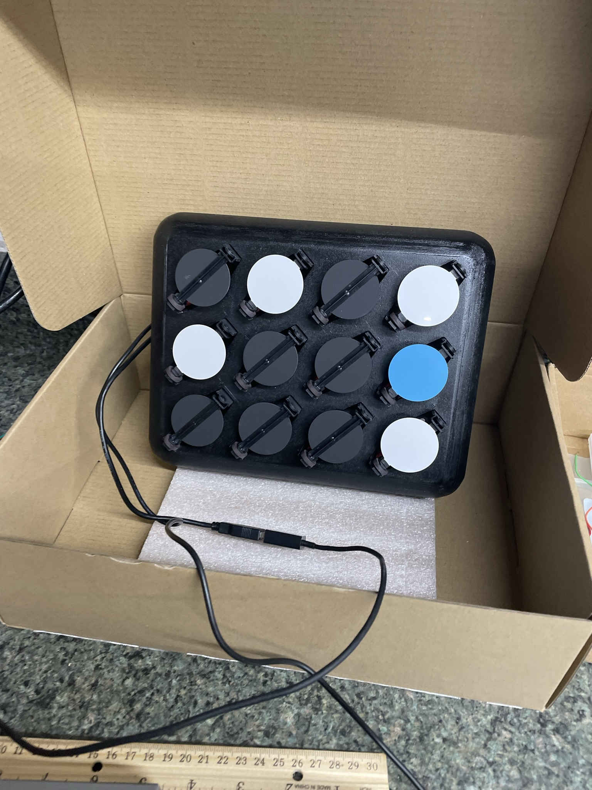
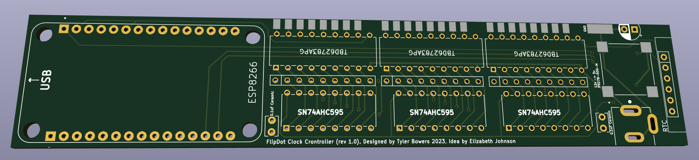
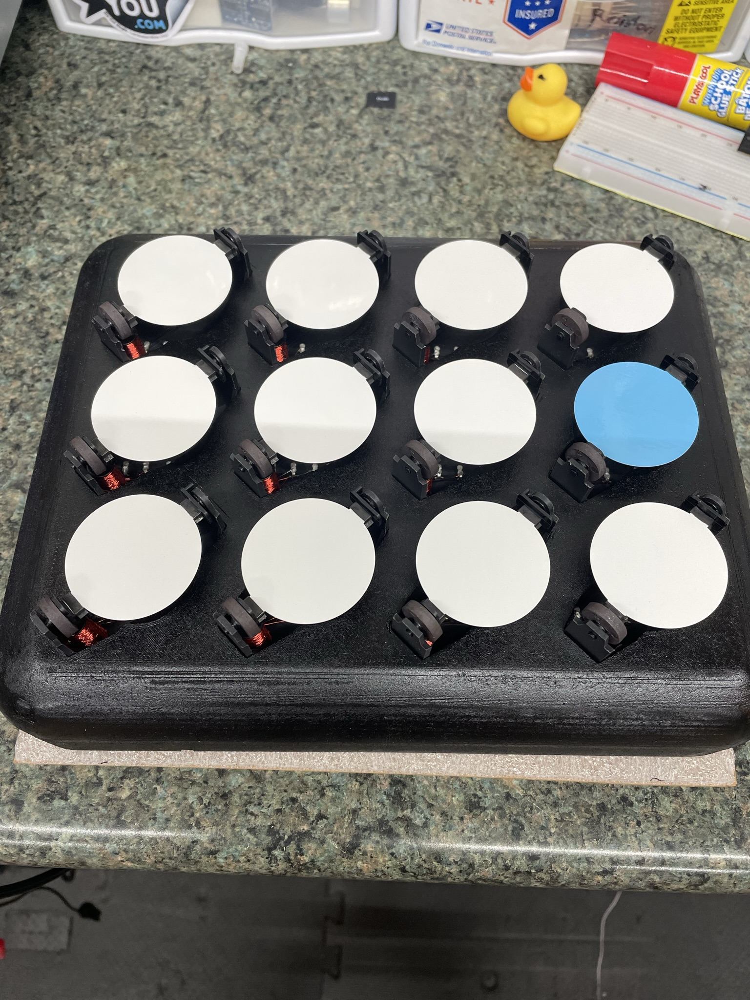
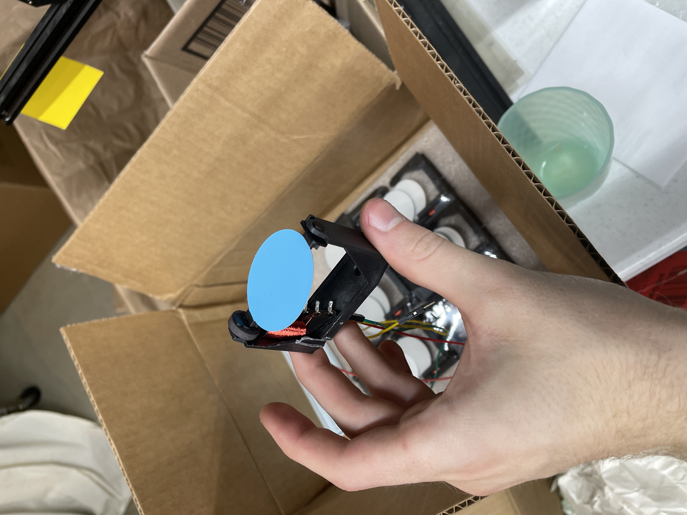

# FlipDot Clock
This repo contains the all parts to the Flipdot Clock that I designed in mid 2023.    
 * Uses large 1.5"dia flipdots from Scoretronics https://www.scoretronics.com/components/
 * Uses RTC module and ESP8266 to sync time daily with tiezone support.
 * Configureable to have MSD on right or left
 * Uses seperate blue dot (or color of your choice) for AM/PM indicator.
 

## Examples:

### Finished Clock

### Board

### All Dots On

### Wiring
![Picture of wiring(images/wiring.JPEG)

### Single Dot

